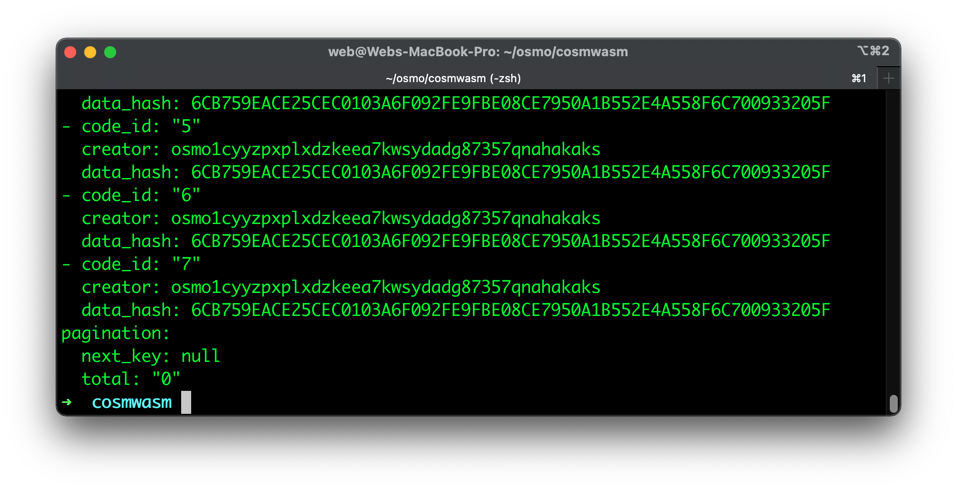
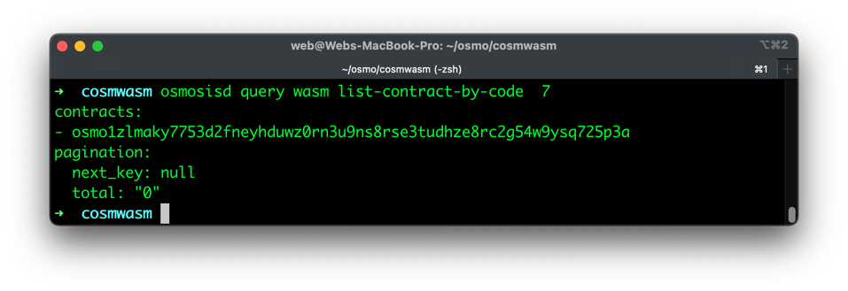

# Javascript & Smart Contracts
This guide describes interacting with Osmosis Smart contracts via JavaScript runtimes such as Node.js and the browser.

## Prerequisites
- npm and node.js
- localosmosis - (Not needed when connecting to mainnet)
- Keplr browser not used on the guide yet

Start a new project
```bash
npm init -y
```
Install cosmwasm
```bash
npm i cosmwasm
```

Open the package.json file in a code editor and add 
```json=
"type": "module",.

  {
        // ...
        "type": "module",
        // ...
    }
```


Create a new index.ts file
```bash
touch index.ts
```

The class CosmWasmClient is exported from the CosmJS package @cosmjs/cosmwasm-stargate. Learn more in the [offical docs](https://cosmwasm.github.io/CosmWasmJS/clients/reading/CosmWasmClient.html).

```javascript=
import { CosmWasmClient } from "cosmwasm";

// This is your rpc endpoint
const rpcEndpoint = "http://localhost:26657/";

async function main() {
  const client = await CosmWasmClient.connect(rpcEndpoint);
  console.log(client);
}

main();
```

:: tip
You can also connect to the mainnet by replacing rpcEndpoint to https://rpc.osmosis.zone/ [Learn more here.](https://docs.osmosis.zone/developing/network/public-endpoints.html#official-endpoints)
::

## Run it

```
npm index.js
```

You should see something like:


## Other methods
As documented on the [official docs](https://cosmwasm.github.io/CosmWasmJS/clients/reading/CosmWasmClient.html#available-methods).

```javascript=
async function moreExamples() {
  const client = await CosmWasmClient.connect(rpcEndpoint);
  const chainId = await client.getChainId()
  const getHeight = await client.getHeight()
  const getAccount = await client.getAccount("osmo1phaxpevm5wecex2jyaqty2a4v02qj7qmlmzk5a")
  const getSequence = await client.getSequence("osmo1phaxpevm5wecex2jyaqty2a4v02qj7qmlmzk5a")
  const getBlock = await client.getBlock(1)
  const getBalance = await client.getBalance("osmo1phaxpevm5wecex2jyaqty2a4v02qj7qmlmzk5a","uosmo")

  console.log(chainId);
  console.log(client);
  console.log(getHeight);
  console.log(getAccount);
  console.log(getSequence);
  console.log(getBlock);
  console.log(getBalance);
}

moreExamples();
```

## Transactions

| Method | Description | Params |
| -------- | -------- | -------- |
| .getTx()     |      | id: string     |
| .searchTx()  |      | query: SearchTxQuery, filter: SearchTxFilter = {}     |
| .txsQuery()  |      | query: string     |


## Codes
| Method | Description | Params |
| -------- | -------- | -------- |
| .getCodes()     |      | none     |
| .getCodeDetails()  |      | codeId: number     |


## Smart Contracts
| Method | Description | Params |
| -------- | -------- | -------- |
| .getContracts()        |      | cideId: number     |
| .getContract()         |      | address: string    |
| .queryContractRaw()    |      | address: string, key: Uint8Array    |
| .queryContractSmart()  |      | address: string, queryMsg: Record<string, unknown>    |


# Querying Smart Contracts

::: warning
Before we query smart contracts in localOsmosis we must [deploy one by following this guide](https://docs.osmosis.zone/developing/dapps/get_started/cosmwasm-localosmosis.html). 
:::

Once you have deployed the smart contract you can get the `<CONTRACT-ID>` by running:

```
osmosisd query wasm list-code
```


In this particular example there are 7 contracts available. The latest one is 7.

You can now get the contract address by running

```
osmosisd query wasm list-contract-by-code <CONTRACT-ID>

```

That's the contract address `osmo1zlmaky7753d2fneyhduwz0rn3u9ns8rse3tudhze8rc2g54w9ysq725p3a` for code contract id 7.

## Get contract 
```javascript
import { CosmWasmClient } from "cosmwasm";

// This is your rpc endpoint
const rpcEndpoint = "http://localhost:26657/";

async function queryContract() {
  const client = await CosmWasmClient.connect(rpcEndpoint);
 
    const getContract = await client.getContract("osmo1zlmaky7753d2fneyhduwz0rn3u9ns8rse3tudhze8rc2g54w9ysq725p3a")
    console.log(getContract);
}

queryContract();

```

Run the code
```
node index.js
```
The output should look like this:


## Get the count from the contract
The contract we are interacting with has a few simple functions. 'get_count', 'increment' and 'reset'. These two functions can be called via by using the `queryContractSmart` method. 

::: tip
Please note there is a complete guide on how to upload the example contract on localOsmosis [here](cosmwasm-localosmosis.html).
:::

```javascript
async function getCount() {
    const client = await CosmWasmClient.connect(rpcEndpoint);

    const getCount = await client.queryContractSmart("osmo1zlmaky7753d2fneyhduwz0rn3u9ns8rse3tudhze8rc2g54w9ysq725p3a",{ "get_count": {}})
    console.log(getCount);
}
getCount();

```

## Increase the counter

```javascript
async function increaseCounter() {
    const client = await CosmWasmClient.connect(rpcEndpoint);

    const increaseCounter = await client.queryContractRaw("osmo1zlmaky7753d2fneyhduwz0rn3u9ns8rse3tudhze8rc2g54w9ysq725p3a","{\"increment\":{}}")
    console.log(increaseCounter);
}

queryContract();

``` 

WIP
