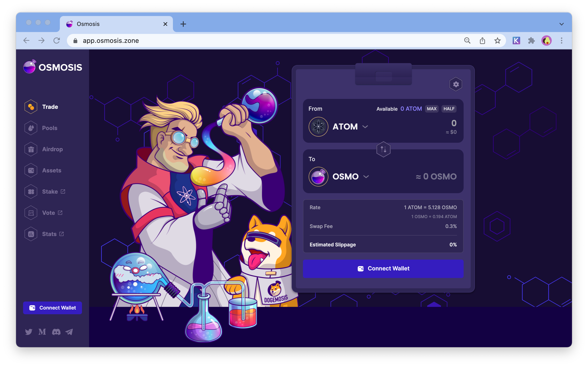

# Osmosis Web Interface
Frontend React app for Osmosis AMM.



## Install global dependencies
To run or build the app, first, need to install `Node.js` and `Yarn` globally;

First Install Node from https://nodejs.org/;

Then install Yarn;
```bash
npm install -g yarn
# OR
sudo npm install -g yarn
```

## Install project dependencies
First clone the repo;
```bash
git clone https://github.com/osmosis-labs/osmosis-frontend.git && cd osmosis-frontend
```

Then install project dependencies;
```bash
yarn
```

## Build
To build the static assets;
```bash
yarn build
```
This should produce `prod` folder with static assets.

Currently, Osmosis frontend app is SPA with entry point: `prod/index.html`

## Development
To spin up the local dev server;
```bash
yarn dev
```
The app should be live at http://localhost:8080

## License

This work is dual-licensed under Apache 2.0 and MIT.
You can choose between one of them if you use this work.

`SPDX-License-Identifier: Apache-2.0 OR MIT`

## Core Functionalities
If you want to build off of Osmosis, here are a few key components to check out!
### Modules
Osmosis' key backend functions are maintained through modules, located under the "x" folder of https://github.com/osmosis-labs/osmosis. Each module manages distinct states but can call on each other's functions. To know more specifics about each module and how they work on Osmosis mainnet, check out https://docs.osmosis.zone/developing/modules/#module-accounts.

### src/pages 
Handles the listing of various CW20 assets, all pools, and each of the pools' various metadata (chainStore, accountStore, poolId, etc.). The "Assets" folder handles all things related to the assets page, and the "Pools" folder handles all things related to the pools. Governance redirects to a separate staking UI on the keplr wallet. "Main" is responsible for the primary landing page where you can swap tokens.

### src/components
Contains tools for connecting account (ConnectAccountButton) and for token swapping / token pair selecting. Pool detail pages, liquidity mining logic, and the superfluid staking UI on bonded LP tokens are also contained here.

### src/hooks
Osmosis' hooks currently provide max gas-fees settings solutions (FakeFeeConfig), account connection/disconnection logic(BasicAmountConfig / useAccountCreation), and pool financial data(usePoolFinancialData).

### src/stores
Root.ts handles logic relating to trade routing and token pricing. If a token does not have a Coingecko price feed, the price gets derived from its relevant price to Osmo. 

### src/dialogs
Dialogs contains components for joining and creating new pools. For a more detailed documentation on the general pool creation UI, check out https://github.com/osmosis-labs/awesome/blob/main/guides/token-listing.md. Specifically, `manage-liquidity.tsx` calculates share outputs given token inputs, with the following formula:

- tokenInAmount = number of tokens of coin A
- poolAsset.amount = total number of tokens of coin A in pool
- totalShare = total gamm shares of pool (with exponent = 18)
- shareOutAmount = tokenInAmount * totalShare / poolAsset.amount

### public/assets
The assets folder contains all graphical assets being currently used for frontend. 

### Config.ts
Config contains various boolean values to hide certain buttons or to promote certain existing / in production pools. It is also the place where external incentive gauges can be added to the Osmosis frontend. Each epoch for reward ditribution is defined here: a day. The channel info for each IBC asset is also handled here. 