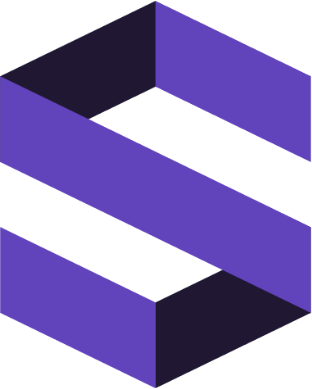

# Documentation

Explore our guides and code examples to integrate and build on Standard. 

  <a href="overview/" class="card">
    
    

      Overview
    

    

      For a basic introduction or to learn how to get started using Standard Protocol
    

  </a>
  <a href="developing/" class="card">
    
    

      Develop
    

    

      Learn about the Standard daemons, CLI, Modules, and create a node to join the testnet or mainnet
    

  </a>

  <a href="validators/" class="card">
    
    

      Validate
    

    

      Turn your node into a validator to earn STND and help secure the network
    

  </a>

  <a href="integrate/" class="card">
    
    

      Integrate
    

    

      Connect your project in Standard ecosystem
    

  </a>

 

  <a href="https://app.standard.tech" class="card lg" target="_blank">
    
    

     Standard App
    

    

      Launch the Standard App 
    

  </a>
<a href="https://discord.gg/x3eRgAWbhw" class="card lg" target="_blank">
    
    

     Discord
    

    

      Chat with the Osmosis community on Discord
    

  </a>
  <a href="https://github.com/osmosis-labs/docs" class="card lg" target="_blank">
    
    

    Found an Issue?
    

    

    Improve this page by adding suggestions on Github.
    

  </a>

 

